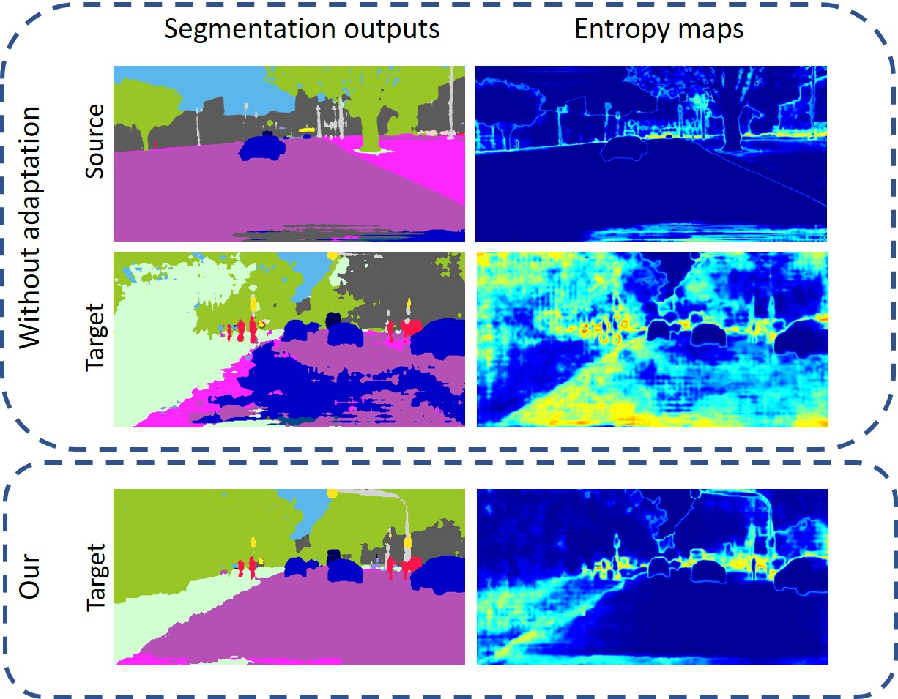

# ADVENT: Adversarial Entropy Minimization for Domain Adaptation in Semantic Segmentation

## Updates
- *02/2020*: Using Cyclegan translated images, The AdvEnt model achieves (**46.3%**) on GTA5-2-Cityscapes
- *09/2019*: check out our new paper [DADA: Depth-aware Domain Adaptation in Semantic Segmentation](https://arxiv.org/abs/1904.01886) (accepted to ICCV 2019). With a depth-aware UDA framework, we leverage depth as the privileged information at train time to boost target performance. [Pytorch](https://github.com/valeoai/DADA) code and pre-trained models are coming soon.

## Paper


[ADVENT: Adversarial Entropy Minimization for Domain Adaptation in Semantic Segmentation](https://arxiv.org/abs/1811.12833)  
 [Tuan-Hung Vu](https://tuanhungvu.github.io/),  [Himalaya Jain](https://himalayajain.github.io/), [Maxime Bucher](https://maximebucher.github.io/), [Matthieu Cord](http://webia.lip6.fr/~cord/), [Patrick Pérez](https://ptrckprz.github.io/)  
 valeo.ai, France  
 IEEE Conference on Computer Vision and Pattern Recognition (CVPR), 2019 (**Oral**)

If you find this code useful for your research, please cite our [paper](https://arxiv.org/abs/1811.12833):

```
@inproceedings{vu2018advent,
  title={ADVENT: Adversarial Entropy Minimization for Domain Adaptation in Semantic Segmentation},
  author={Vu, Tuan-Hung and Jain, Himalaya and Bucher, Maxime and Cord, Mathieu and P{\'e}rez, Patrick},
  booktitle={CVPR},
  year={2019}
}
```

## Abstract
Semantic segmentation is a key problem for many computer vision tasks. While approaches based on convolutional neural networks constantly break new records on different benchmarks, generalizing well to diverse testing environments remains a major challenge. In numerous real world applications, there is indeed a large gap between data distributions in train and test domains, which results in severe performance loss at run-time. In this work, we address the task of unsupervised domain adaptation in semantic segmentation with losses based on the entropy of the pixel-wise predictions. To this end, we propose two novel, complementary methods using (i) an entropy loss and (ii) an adversarial loss respectively. We demonstrate state-of-the-art performance in semantic segmentation on two challenging *synthetic-2-real* set-ups and show that the approach can also be used for detection.

## Demo
[](http://www.youtube.com/watch?v=Ihmz0yEqrq0 "")

## Preparation

### Pre-requisites
* Python 3.7
* Pytorch >= 0.4.1
* CUDA 9.0 or higher

### Installation
0. Clone the repo:
```bash
$ git clone https://github.com/valeoai/ADVENT
$ cd ADVENT
```

1. Install OpenCV if you don't already have it:

```bash
$ conda install -c menpo opencv
```

2. Install this repository and the dependencies using pip:
```bash
$ pip install -e <root_dir>
```

With this, you can edit the ADVENT code on the fly and import function 
and classes of ADVENT in other project as well.

3. Optional. To uninstall this package, run:
```bash
$ pip uninstall ADVENT
```

You can take a look at the [Dockerfile](./Dockerfile) if you are uncertain about steps to install this project.

### Datasets
By default, the datasets are put in ```<root_dir>/data```. We use symlinks to hook the ADVENT codebase to the datasets. An alternative option is to explicitlly specify the parameters ```DATA_DIRECTORY_SOURCE``` and ```DATA_DIRECTORY_TARGET``` in YML configuration files.

* **GTA5**: Please follow the instructions [here](https://download.visinf.tu-darmstadt.de/data/from_games/) to download images and semantic segmentation annotations. The GTA5 dataset directory should have this basic structure:
```bash
<root_dir>/data/GTA5/                               % GTA dataset root
<root_dir>/data/GTA5/images/                        % GTA images
<root_dir>/data/GTA5/labels/                        % Semantic segmentation labels
...
```

* **Cityscapes**: Please follow the instructions in [Cityscape](https://www.cityscapes-dataset.com/) to download the images and validation ground-truths. The Cityscapes dataset directory should have this basic structure:
```bash
<root_dir>/data/Cityscapes/                         % Cityscapes dataset root
<root_dir>/data/Cityscapes/leftImg8bit              % Cityscapes images
<root_dir>/data/Cityscapes/leftImg8bit/val
<root_dir>/data/Cityscapes/gtFine                   % Semantic segmentation labels
<root_dir>/data/Cityscapes/gtFine/val
...
```

### Pre-trained models
Pre-trained models can be downloaded [here](https://github.com/valeoai/ADVENT/releases) and put in ```<root_dir>/pretrained_models```

## Running the code
For evaluation, execute:
```bash
$ cd <root_dir>/advent/scripts
$ python test.py --cfg ./configs/advent_pretrained.yml
$ python test.py --cfg ./configs/advent_cyclegan_pretrained.yml 	% trained on cycleGAN translated images
$ python test.py --cfg ./configs/minent_pretrained.yml
$ python test.py --cfg ./configs/advent+minent.yml
```

### Training
For the experiments done in the paper, we used pytorch 0.4.1 and CUDA 9.0. To ensure reproduction, the random seed has been fixed in the code. Still, you may need to train a few times to reach the comparable performance.

By default, logs and snapshots are stored in ```<root_dir>/experiments``` with this structure:
```bash
<root_dir>/experiments/logs
<root_dir>/experiments/snapshots
```

To train AdvEnt:
```bash
$ cd <root_dir>/advent/scripts
$ python train.py --cfg ./configs/advent.yml
$ python train.py --cfg ./configs/advent.yml --tensorboard         % using tensorboard
```
To train MinEnt:
```bash
$ python train.py --cfg ./configs/minent.yml
$ python train.py --cfg ./configs/minent.yml --tensorboard         % using tensorboard
```

### Testing
To test AdvEnt:
```bash
$ cd <root_dir>/advent/scripts
$ python test.py --cfg ./configs/advent.yml
```
To test MinEnt:
```bash
$ python test.py --cfg ./configs/minent.yml
```

## Acknowledgements
This codebase is heavily borrowed from [AdaptSegNet](https://github.com/wasidennis/AdaptSegNet) and [Pytorch-Deeplab](https://github.com/speedinghzl/Pytorch-Deeplab).

## License
ADVENT is released under the [Apache 2.0 license](./LICENSE).
